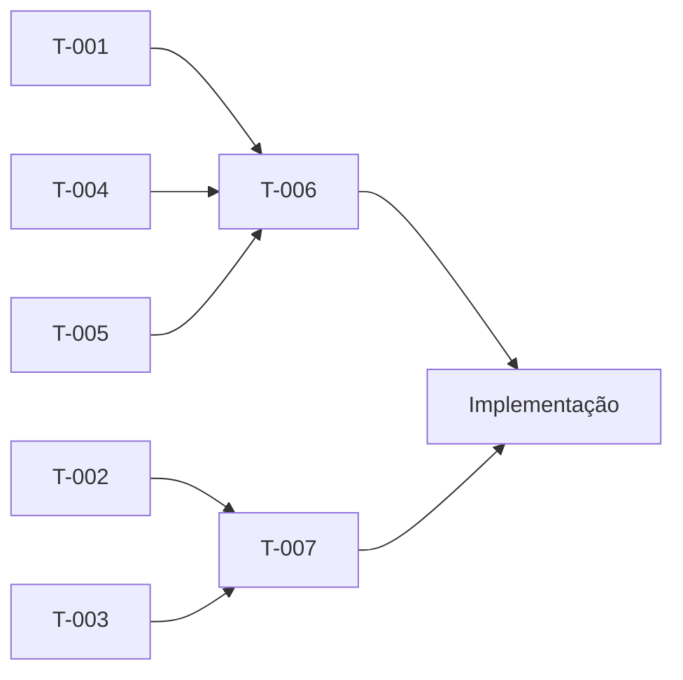

# Backlog — corre-patinho

> Última atualização: 2026-04-24

## Referência Rápida

| ID | Título | Status | Prioridade |
|---|---|---|---|
| T-001 | Definir mecânica de input (controles) | 🟡 Pendente | Alta |
| T-002 | Escolher engine de renderização | 🟡 Pendente | Alta |
| T-003 | Definir tooling de build (Vite, etc.) | 🟡 Pendente | Alta |
| T-004 | Especificar algoritmo de geração procedural do percurso | 🟡 Pendente | Alta |
| T-005 | Definir sistema de pontuação/score | 🟡 Pendente | Média |
| T-006 | Criar spec 02-GAME-MECHANICS (mecânicas detalhadas) | 🟡 Pendente | Alta |
| T-007 | Criar spec 03-TECH-STACK (arquitetura técnica) | 🟡 Pendente | Alta |

## Grupos

### 🎮 Specs Pendentes

- `[ ]` **T-006** — Criar `02-GAME-MECHANICS.md`: detalhar mecânica de input (T-001), algoritmo de geração de percurso (T-004), física da descida, sistema de pontuação (T-005)
- `[ ]` **T-007** — Criar `03-TECH-STACK.md`: engine de renderização (T-002), tooling de build (T-003), estrutura de diretórios do código, dependências

### 🏗️ Decisões Técnicas Pendentes

- `[ ]` **T-001** — Definir mecânica de input: touch/swipe, botões, slider ou combinação
- `[ ]` **T-002** — Escolher engine de renderização: Canvas 2D, WebGL, Three.js, Phaser, Babylon.js ou outro
- `[ ]` **T-003** — Definir tooling de build: Vite, webpack, etc.

### 📐 Design de Jogo

- `[ ]` **T-004** — Especificar algoritmo de geração procedural: parâmetros por dificuldade, seed, validação de percurso jogável
- `[ ]` **T-005** — Definir sistema de pontuação: critérios (tempo, curvas acertadas, distância), persistência local

## Mapa de Dependências

