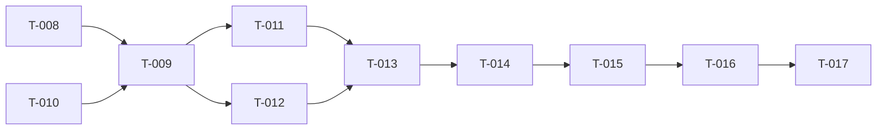

# Backlog — corre-patinho

> Última atualização: 2026-04-25

## Referência Rápida

| ID | Título | Status | Prioridade |
|---|---|---|---|
| T-001 | Definir mecânica de input (controles) | ✅ Concluído | — |
| T-002 | Escolher engine de renderização | ✅ Concluído | — |
| T-003 | Definir tooling de build (Vite, etc.) | ✅ Concluído | — |
| T-004 | Especificar algoritmo de geração procedural do percurso | ✅ Concluído | — |
| T-005 | Definir sistema de pontuação/score | ✅ Concluído | — |
| T-006 | Criar spec 02-GAME-MECHANICS (mecânicas detalhadas) | ✅ Concluído | — |
| T-007 | Criar spec 03-TECH-STACK (arquitetura técnica) | ✅ Concluído | — |
| T-008 | Inicializar projeto Vite + TypeScript | ✅ Concluído | — |
| T-009 | Implementar protótipo mínimo (Canvas 2D + tobogã reto + swipe) | ✅ Concluído | — |
| T-010 | Criar assets de sprites (patinho + cenário) | ✅ Concluído | — |
| T-011 | Implementar geração procedural do percurso | ✅ Concluído | — |
| T-012 | Implementar sistema de input (swipe + teclado) | ✅ Concluído | — |
| T-013 | Implementar HUD (score, vidas, mute) | ✅ Concluído | — |
| T-014 | Implementar menus (início, dificuldade, game over, high scores) | ✅ Concluído | — |
| T-015 | Integrar Howler.js (música + SFX) | ✅ Concluído | — |
| T-016 | Configurar PWA (service worker, manifest, offline) | ✅ Concluído | — |
| T-017 | Implementar tela de orientação (aviso portrait → landscape) | 🟡 Pendente | Baixa |

## Grupos

### ✅ Especificação (Concluído)

- `[x]` **T-006** — Criar `02-GAME-MECHANICS.md`: mecânica de input (T-001), algoritmo de geração de percurso (T-004), física da descida, sistema de pontuação (T-005), sistema de vidas
- `[x]` **T-007** — Criar `03-TECH-STACK.md`: engine de renderização (T-002), tooling de build (T-003), estrutura de diretórios, dependências

### 🏗️ Decisões Técnicas (Concluído)

- `[x]` **T-001** — Input: swipe lateral contínuo (mobile) + setas/A-D (desktop) → `02-GAME-MECHANICS.md § 2`
- `[x]` **T-002** — Engine: Canvas 2D pseudo-3D → `03-TECH-STACK.md § 3`
- `[x]` **T-003** — Build: Vite + vite-plugin-pwa → `03-TECH-STACK.md § 2`
- `[x]` **T-004** — Percurso infinito, ~2min, seed compartilhável → `02-GAME-MECHANICS.md § 3`
- `[x]` **T-005** — Score: distância percorrida, localStorage, top 10 por dificuldade → `02-GAME-MECHANICS.md § 5`

### 🚀 Implementação — Setup

- `[x]` **T-008** — Inicializar projeto Vite + TypeScript: `npx create-vite`, configurar `tsconfig.json`, instalar `howler` e `vite-plugin-pwa`
- `[x]` **T-009** — Protótipo mínimo: canvas fullscreen, tobogã reto descendo (pseudo-3D), sprite do patinho, swipe básico. Validar que o gameplay loop funciona.

### 🎮 Implementação — Core

- `[x]` **T-010** — Criar/obter assets de sprites: patinho (idle, curva esquerda, curva direita, susto, queda), tobogã, cenário (árvores, nuvens, etc.)
- `[x]` **T-011** — Geração procedural: PRNG seedable, segmentos (reto/curva), parâmetros por dificuldade, rampa de dificuldade progressiva
- `[x]` **T-012** — Input: captura de touch/swipe full-screen, normalização, suporte a teclado desktop, inércia (~200ms)

### 🖼️ Implementação — UI & Polish

- `[x]` **T-013** — HUD: score (distância), vidas (ícones), botão mute, sinalização de curvas (modo Fácil com formas + cores)
- `[x]` **T-014** — Menus: tela inicial, seleção de dificuldade, game over (score, recorde, seed, retry), high scores (top 10 por dificuldade)
- `[x]` **T-015** — Áudio: integrar Howler.js, carregar sprites de áudio, música de fundo loop, SFX, estado muted em localStorage
- `[x]` **T-016** — PWA: vite-plugin-pwa, manifest (landscape, fullscreen), service worker (cache-first), prompt de update
- `[ ]` **T-017** — Layout: orientação landscape forçada, overlay portrait, letterboxing 16:9, max viewport desktop

## Mapa de Dependências

